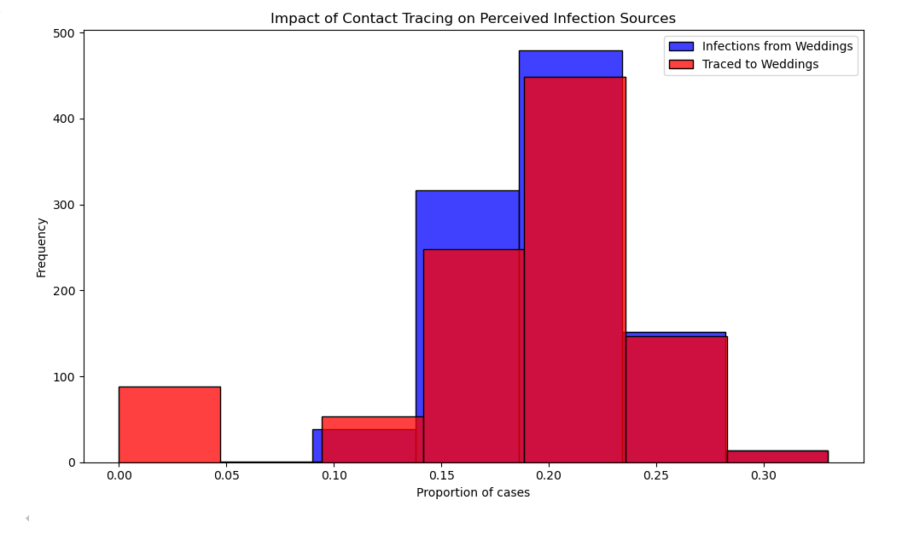

# ASSIGNMENT: Sampling and Reproducibility in Python

Read the blog post [Contact tracing can give a biased sample of COVID-19 cases](https://andrewwhitby.com/2020/11/24/contact-tracing-biased/) by Andrew Whitby to understand the context and motivation behind the simulation model we will be examining.

Examine the code in `whitby_covid_tracing.py`. Identify all stages at which sampling is occurring in the model. Describe in words the sampling procedure, referencing the functions used, sample size, sampling frame, any underlying distributions involved, and how these relate to the procedure outlined in the blog post.

Run the Python script file called whitby_covid_tracing.py as is and compare the results to the graphs in the original blog post. Does this code appear to reproduce the graphs from the original blog post?

Modify the number of repetitions in the simulation to 1000 (from the original 50000). Run the script multiple times and observe the outputted graphs. Comment on the reproducibility of the results.

Alter the code so that it is reproducible. Describe the changes you made to the code and how they affected the reproducibility of the script file. The output does not need to match Whitby’s original blogpost/graphs, it just needs to produce the same output when run multiple times

# Author: Anis Bouazra

Question: Examine the code in `whitby_covid_tracing.py`. Identify all stages at which sampling is occurring in the model. Describe in words the sampling procedure, referencing the functions used, sample size, sampling frame, any underlying distributions involved, and how these relate to the procedure outlined in the blog post.

My Answer: 

1. Sampling individuals with infection: 
    Python Code: ATTACK_RATE = 0.10
                 events = ['wedding'] * 200 + ['brunch'] * 800
                    ppl = pd.DataFrame({
                    'event': events,
                    'infected': False,
                    'traced': np.nan  # Initially setting traced status as NaN
                })
    Explanation: 
    Randomly select 10% of attendees 
    Sample Size : 1000 attendees * ATTACK_RATE (10%) = 100 infected
    Sampling Frame: all attendees

2. Primary Contact Tracing 
    Sample Size: 100 infected * 20% (TRACE_SUCCESS = 0.20) = 20 Traced
    Sampling Frame: all infected individuals 

3. Secondary Contact Tracing 
    If more than two individuals from an event are traced in a primary contact tracing, then all infected attendees of that event are  traced. 
    Sample Size: All infected attended 
    Sampling Frame: Events with more than 2 traced cases

4. Run the simulation 50000 times 
    Sample Size: 50000 iterations
    Distribution : Normal distribution

Question: Run the Python script file called whitby_covid_tracing.py as is and compare the results to the graphs in the original blog post. Does this code appear to reproduce the graphs from the original blog post?

    >> In both graph from our simulation and the blog post, the results are similar, where the proportion of infections from weddings revolves around 0.20 (20% of attendees).
    >> After performing contact tracing, both grahs showcase higher observed traced cases linked to weddings (peaking  at 0.25 in our simulation ). That said, the code produces  the same observation from the orginal blog post , further confirming the blog post's argument contact that tracing introduces bias. 

Question: Modify the number of repetitions in the simulation to 1000 (from the original 50000). Run the script multiple times and observe the outputted graphs. Comment on the reproducibility of the results.
    At 1000 repetitions: 
    At 5000 repetitions: 
With fewer iterations, the simulation distribution has higher variance, leading to noisier results (law of large numbers) , however, Even with 1,000 runs, the mean picks close to 0.20. 

Questions: Alter the code so that it is reproducible. Describe the changes you made to the code and how they affected the reproducibility of the script file. The output does not need to match Whitby’s original blogpost/graphs, it just needs to produce the same output when run multiple times
    To ensure the reproduciblity of our code, i added a random seed function to ensure consistency every time we execute our code, with identical results everytime we execute our code  (E.g: np.random.seed(40))

## Criteria

|Criteria|Complete|Incomplete|
|--------|----|----|
|Altercation of the code|The code changes made, made it reproducible.|The code is still not reproducible.|
|Description of changes|The author explained the reasonings for the changes made well.|The author did not explain the reasonings for the changes made well.|

## Submission Information

🚨 **Please review our [Assignment Submission Guide](https://github.com/UofT-DSI/onboarding/blob/main/onboarding_documents/submissions.md)** 🚨 for detailed instructions on how to format, branch, and submit your work. Following these guidelines is crucial for your submissions to be evaluated correctly.

### Submission Parameters:
* Submission Due Date: `HH:MM AM/PM - DD/MM/YYYY`
* The branch name for your repo should be: `sampling-and-reproducibility`
* What to submit for this assignment:
    * This markdown file (sampling_and_reproducibility.md) should be populated.
    * The `whitby_covid_tracing.py` should be changed.
* What the pull request link should look like for this assignment: `https://github.com/<your_github_username>/sampling/pull/<pr_id>`
    * Open a private window in your browser. Copy and paste the link to your pull request into the address bar. Make sure you can see your pull request properly. This helps the technical facilitator and learning support staff review your submission easily.

Checklist:
- [ ] Create a branch called `sampling-and-reproducibility`.
- [ ] Ensure that the repository is public.
- [ ] Review [the PR description guidelines](https://github.com/UofT-DSI/onboarding/blob/main/onboarding_documents/submissions.md#guidelines-for-pull-request-descriptions) and adhere to them.
- [ ] Verify that the link is accessible in a private browser window.

If you encounter any difficulties or have questions, please don't hesitate to reach out to our team via our Slack at `#cohort-3-help`. Our Technical Facilitators and Learning Support staff are here to help you navigate any challenges.
